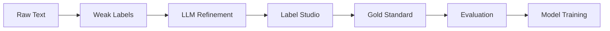

<div align="center">


**Biomedical NER with BioBERT, Weak Labeling, and LLM Refinement**

[](https://github.com/paulboys/SpanForge/actions/workflows/test.yml)
[](https://www.python.org/downloads/)
[](https://opensource.org/licenses/MIT)
[](https://github.com/paulboys/SpanForge/releases/tag/v0.5.0)

</div>

SpanForge extracts adverse events and product mentions from consumer complaints using **BioBERT embeddings**, **lexicon-driven weak labeling**, and **LLM-powered refinement**, with a production-ready annotation workflow built around Label Studio and comprehensive evaluation tooling.

📚 **[Full Documentation](https://paulboys.github.io/SpanForge/)** | 🚀 **[Quick Start](#quick-start)** | 📖 **[Tutorial Notebook](scripts/AnnotationWalkthrough.ipynb)**

---

## ✨ Key Features

- 🔬 **BioBERT Integration**: Biomedical encoder (`dmis-lab/biobert-base-cased-v1.1`)
- 📝 **Weak Labeling**: Fuzzy (0.88), Jaccard gate (≥40), negation window (±5), emoji handling
- 🤖 **LLM Refinement**: Boundary correction, negation validation, canonical normalization (OpenAI, Azure OpenAI, Anthropic)
- 📊 **Evaluation Harness**: 10 metrics (IOU, boundary precision, correction rate, calibration, P/R/F1)
- 📈 **Visualization**: Publication-quality plots (IOU uplift, calibration, correction breakdown, P/R/F1, stratified)
- 🎯 **Annotation Workflow**: Label Studio config + CLI scripts for import/export, consensus, quality, registry
- 🧪 **Tests**: 296 tests total; 99.3% passing (1 flaky performance test)
- 📕 **Docs**: 2,000+ lines with tutorials and production guides
- ⚠️ **Security**: Bandit configured; HF `from_pretrained` revision pinning tracked (B615) for pre-prod

## 🚀 Quick Start

```bash
# Clone and setup
git clone https://github.com/paulboys/SpanForge.git
cd SpanForge
pip install -r requirements.txt

# Weak label a single text
python -c "
from src.weak_label import load_symptom_lexicon, load_product_lexicon, weak_label
from pathlib import Path

symptom_lex = load_symptom_lexicon(Path('data/lexicon/symptoms.csv'))
product_lex = load_product_lexicon(Path('data/lexicon/products.csv'))

text = 'After using this facial moisturizer, I developed severe burning sensation and redness.'
spans = weak_label(text, symptom_lex, product_lex)
print(spans)"

# End-to-end: pipeline → JSONL
python -m src.pipeline --input raw_text.txt --output data/output/weak_labels.jsonl

# Optional: LLM refinement
python -m src.llm_agent --weak data/output/weak_labels.jsonl --output data/output/llm_refined.jsonl

## 📋 Workflow



### Current Phases

- ✅ Phases 1–4: Bootstrap, weak labeling, tests, CI/CD
- ✅ Phase 4.5: LLM refinement + evaluation harness
- ✅ Phase 5: Annotation infrastructure (Label Studio + tutorial)
- 🚧 Phase 6: Gold standard assembly (in progress)
- ⏳ Phase 7: Token classification fine-tune (BioBERT + head)
- ⏳ Phase 8–10: Domain adaptation, baselines, calibration, active learning

## Architecture Overview
```
Raw Text → Weak Labeler ─┬─► Weak JSONL → Label Studio Tasks → Human Annotation
                          │
                          └─► (Optional pre-annotation predictions)

Human Export → Gold Converter (+canonical +provenance) → Gold JSONL → Quality Metrics / Registry
                                                    └─► Future: BIO Tagging & Model Fine-Tune
```

## 📊 Benchmarks (Fixture-based)

- **IOU Improvement**: +13.4% (weak → LLM)
- **Exact Match Rate**: 66.7% → 100.0% after refinement
- **F1 Score**: 1.000 (LLM vs gold on fixtures)
- **Processing Speed**: <100ms per document (small texts)
- **Test Coverage**: 81.2% overall; 100% for `pipeline.py`, `model.py`, `model_token_cls.py`

## 📦 Project Structure

```
SpanForge/
├── src/                    # Core modules
│   ├── config.py          # Configuration management
│   ├── model.py           # BioBERT loading
│   ├── weak_label.py      # Weak labeling logic
│   ├── pipeline.py        # End-to-end pipeline
│   ├── llm_agent.py       # LLM refinement
│   └── evaluation/        # Metrics (10 functions)
├── scripts/
│   ├── AnnotationWalkthrough.ipynb  # Tutorial (7 sections)
│   └── annotation/        # CLI tools (bootstrap, import-weak, export-convert, quality, adjudicate, register, evaluate-llm, plot-metrics)
├── data/
│   ├── lexicon/           # Symptoms & products
│   └── annotation/        # Label Studio config
├── tests/                 # 296 tests (99.3% passing; 1 flaky perf test)
└── docs/                  # 2,000+ lines of documentation
```

## 🧪 Testing
```powershell
pytest -q
```
Focus: weak labeling edge cases, LLM refinement validation, metrics integrity, and pipeline determinism. Token classification tests will join in Phase 7.

## 🗺️ Roadmap
1. Bootstrap & Lexicon (DONE)
2. Weak Label Refinement (DONE)
3. Test Infrastructure & Edge Cases (DONE)
4. CI/CD Integration (DONE)
4.5. LLM-Based Refinement (DONE)
5. Annotation & Curation (IN PROGRESS)
6. Gold Standard Assembly (NEXT)
7. Token Classification Fine‑Tune (PLANNED)
8. Domain Adaptation (PLANNED)
9. Baseline Comparison (PLANNED)
10. Evaluation & Calibration (PARTIAL)
11. Educational Docs Expansion (ONGOING)
12. Continuous Improvement & Active Learning (PLANNED)

## 🤝 Contributing
1. Create env & install deps.
2. Run `scripts/verify_env.py` and tests.
3. Inspect lexicons; propose additions via PR (no licensed MedDRA raw data).
4. Use notebook or scripts to generate weak → tasks.
5. Perform annotation batch locally; convert + quality + register.
6. Submit focused PR referencing roadmap phase.

## 🔐 Privacy & Compliance
- Do NOT commit raw complaint text containing PII (keep outside `data/` or use redacted versions).
- Telemetry disabled for Label Studio (`LABEL_STUDIO_DISABLE_TELEMETRY=1`).
- Canonical mapping strives for consistent terminology without storing licensed vocabularies.

## Next Steps
- Expand annotated corpus; measure agreement.
- Implement consensus / adjudication enhancements & kappa.
- Add token classification training script + BIO tagging conversion.
- Introduce evaluation harness (precision/recall/F1 on held-out gold).

## Reference Docs
- `docs/overview.md`
- `docs/annotation_guide.md`
- `docs/tutorial_labeling.md`
- `docs/heuristic.md`
- `docs/phase_6_gold_standard.md`
- `docs/phase_6_checklist.md`
- `scripts/caers/README.md`

## 🗺️ Roadmap

- [x] **Phase 1-4**: Bootstrap, weak labeling, testing, CI/CD
- [x] **Phase 4.5**: LLM refinement & evaluation harness (comprehensive tests)
- [x] **Phase 5**: Annotation infrastructure (Label Studio + tutorial)
- [ ] **Phase 6**: Gold standard assembly (500+ annotations)
- [ ] **Phase 7**: Token classification fine-tuning
- [ ] **Phase 8-10**: Domain adaptation, baselines, production deployment

See **[Detailed Roadmap](docs/about/roadmap.md)** and **[Changelog](docs/about/changelog.md)**.

## 📚 Documentation

- **[Installation Guide](docs/installation.md)** - Setup instructions
- **[Quick Start Tutorial](docs/quickstart.md)** - Basic usage examples
- **[Annotation Tutorial](scripts/AnnotationWalkthrough.ipynb)** - Interactive notebook (7 sections)
- **[Production Workflow](docs/production_workflow.md)** - Complete annotation guide (450+ lines)
- **[LLM Integration](docs/llm_integration.md)** - Provider config and usage
- **[API Reference](https://paulboys.github.io/SpanForge/api/config/)** - Full API docs

## 🤝 Contributing

Contributions welcome! See **[Contributing Guide](docs/development/contributing.md)**.

1. Fork the repository
2. Create a feature branch
3. Run tests: `pytest tests/ -v`
4. Submit a pull request

## 📄 License

MIT License - see [LICENSE](LICENSE) for details.

## 🔗 Links

- **Documentation**: https://paulboys.github.io/SpanForge/
- **Repository**: https://github.com/paulboys/SpanForge
- **Issues**: https://github.com/paulboys/SpanForge/issues
- **Releases**: https://github.com/paulboys/SpanForge/releases

---

**Version**: 0.5.0 | **Status**: Annotation-Ready | **Updated**: November 28, 2025