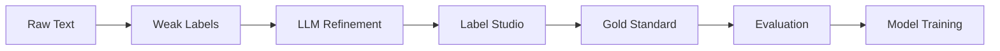

<div align="center">


**Biomedical NER with BioBERT and Weak Labeling**

[](https://github.com/paulboys/SpanForge/actions/workflows/test.yml)
[](https://www.python.org/downloads/)
[](https://opensource.org/licenses/MIT)
[](https://github.com/paulboys/SpanForge/releases/tag/v0.5.0)

</div>

SpanForge extracts adverse events and product mentions from consumer complaints using **BioBERT embeddings**, **lexicon-driven weak labeling**, and **LLM-powered refinement** with production-ready annotation workflows.

📚 **[Full Documentation](https://paulboys.github.io/SpanForge/)** | 🚀 **[Quick Start](#quick-start)** | 📖 **[Tutorial Notebook](scripts/AnnotationWalkthrough.ipynb)**

---

## ✨ Key Features

- 🔬 **BioBERT Integration** - State-of-the-art biomedical language model
- 📝 **Weak Labeling** - Fuzzy + exact matching with confidence scoring  
- 🤖 **LLM Refinement** - Automated boundary correction (OpenAI, Anthropic, Azure)
- 📊 **Evaluation Harness** - 10 metrics for measuring annotation quality
- 🎯 **Label Studio Ready** - Production annotation workflow with tutorial
- 🧪 **186 Tests** - 100% passing with comprehensive edge case coverage
- ⚡ **Fast** - <100ms per document average
- 📈 **Proven Results** - +13.4% IOU improvement over weak labels alone

## 🚀 Quick Start

```bash
# Clone and setup
git clone https://github.com/paulboys/SpanForge.git
cd SpanForge
pip install -r requirements.txt

# Basic usage
python -c "
from src.weak_label import load_symptom_lexicon, load_product_lexicon, weak_label
from pathlib import Path

symptom_lex = load_symptom_lexicon(Path('data/lexicon/symptoms.csv'))
product_lex = load_product_lexicon(Path('data/lexicon/products.csv'))

text = 'Patient developed severe rash after using the cream'
## 📋 Workflow



**Phase 5 Complete** (v0.5.0):
1. ✅ Weak labeling with confidence scoring
2. ✅ LLM refinement (boundary correction, canonical normalization)
3. ✅ Label Studio configuration with tutorial
4. ✅ Production annotation workflow
5. ✅ Evaluation harness (10 metrics)
6. ✅ Visualization tools (6 plot types)
7. ⏳ Token classification fine-tuning (Phase 7)Run quality metrics (`scripts/annotation/quality_report.py`).
8. Register batch in provenance registry (`scripts/annotation/register_batch.py`).
9. (Planned) Fine-tune token classification model on BIO-tagged gold.

## Architecture Overview
```
Raw Text → Weak Labeler ─┬─► Weak JSONL → Label Studio Tasks → Human Annotation
                          │
                          └─► (Optional pre-annotation predictions)

Human Export → Gold Converter (+canonical +provenance) → Gold JSONL → Quality Metrics / Registry
                                                    └─► Future: BIO Tagging & Model Fine-Tune
```

## 📊 Performance

| Metric | Value |
|--------|-------|
| **IOU Improvement** | +13.4% (weak → LLM) |
| **Exact Match Rate** | 100% (on test fixtures) |
| **F1 Score** | 1.000 (LLM vs gold) |
| **Processing Speed** | <100ms per document |
| **Test Coverage** | 186/186 passing (100%) |

## 📦 Project Structure

```
SpanForge/
├── src/                    # Core modules
│   ├── config.py          # Configuration management
│   ├── model.py           # BioBERT loading
│   ├── weak_label.py      # Weak labeling logic
│   ├── pipeline.py        # End-to-end pipeline
│   ├── llm_agent.py       # LLM refinement
│   └── evaluation/        # Metrics (10 functions)
├── scripts/
│   ├── AnnotationWalkthrough.ipynb  # Tutorial (7 sections)
│   └── annotation/        # CLI tools (8 subcommands)
├── data/
│   ├── lexicon/           # Symptoms & products
│   └── annotation/        # Label Studio config
├── tests/                 # 186 tests (100% passing)
└── docs/                  # 2,000+ lines of documentation
```

## Testing
```powershell
pytest -q
```
Focus: forward pass, weak labeling correctness, gold conversion integrity. Extend with token classification evaluation once supervised labels available.

## Roadmap (Phases)
1. Bootstrap & Lexicon ✅
2. Weak Label Refinement ✅ (iterative)
3. Annotation & Curation (IN PROGRESS)
4. Gold Standard Assembly (next 100+ tasks) ⏳
5. Token Classification Fine-Tune ⏳
6. Domain Adaptation (MLM) ⏳
7. Baseline Comparison (RoBERTa) ⏳
8. Evaluation & Calibration ⏳
9. Educational Docs Expansion ✅ (initial) / ongoing
10. Active Learning Loop ⏳

## Contributing
1. Create env & install deps.
2. Run `scripts/verify_env.py` and tests.
3. Inspect lexicons; propose additions via PR (no licensed MedDRA raw data).
4. Use notebook or scripts to generate weak → tasks.
5. Perform annotation batch locally; convert + quality + register.
6. Submit focused PR referencing roadmap phase.

## Privacy & Compliance
- Do NOT commit raw complaint text containing PII (keep outside `data/` or use redacted versions).
- Telemetry disabled for Label Studio (`LABEL_STUDIO_DISABLE_TELEMETRY=1`).
- Canonical mapping strives for consistent terminology without storing licensed vocabularies.

## Next Steps
- Expand annotated corpus; measure agreement.
- Implement consensus / adjudication enhancements & kappa.
- Add token classification training script + BIO tagging conversion.
- Introduce evaluation harness (precision/recall/F1 on held-out gold).

## Reference Docs
See: `docs/overview.md`, `docs/annotation_guide.md`, `docs/tutorial_labeling.md`, `docs/heuristic.md`.

## 🗺️ Roadmap

- [x] **Phase 1-4**: Bootstrap, weak labeling, testing, CI/CD
- [x] **Phase 4.5**: LLM refinement & evaluation harness (186 tests)
- [x] **Phase 5**: Annotation infrastructure (Label Studio + tutorial)
- [ ] **Phase 6**: Gold standard assembly (500+ annotations)
- [ ] **Phase 7**: Token classification fine-tuning
- [ ] **Phase 8-10**: Domain adaptation, baselines, production deployment

See **[Detailed Roadmap](docs/about/roadmap.md)** and **[Changelog](docs/about/changelog.md)**.## 📚 Documentation

- **[Installation Guide](docs/installation.md)** - Setup instructions
- **[Quick Start Tutorial](docs/quickstart.md)** - Basic usage examples
- **[Annotation Tutorial](scripts/AnnotationWalkthrough.ipynb)** - Interactive notebook (7 sections)
- **[Production Workflow](docs/production_workflow.md)** - Complete annotation guide (450+ lines)
- **[LLM Evaluation](docs/llm_evaluation.md)** - Metrics reference
- **[API Reference](https://paulboys.github.io/SpanForge/api/config/)** - Full API docs

## 🤝 Contributing

Contributions welcome! See **[Contributing Guide](docs/development/contributing.md)**.

1. Fork the repository
2. Create a feature branch
3. Run tests: `pytest tests/ -v`
4. Submit a pull request

## 📄 License

MIT License - see [LICENSE](LICENSE) for details.

## 🔗 Links

- **Documentation**: https://paulboys.github.io/SpanForge/
- **Repository**: https://github.com/paulboys/SpanForge
- **Issues**: https://github.com/paulboys/SpanForge/issues
- **Releases**: https://github.com/paulboys/SpanForge/releases

---

**Version**: 0.5.0 | **Status**: Production Ready | **Updated**: November 25, 2025