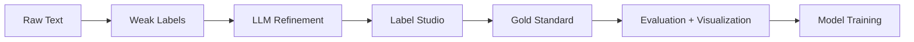

# SpanForge

**Biomedical Named Entity Recognition with BioBERT, Weak Labeling, and LLM Refinement**

[](https://github.com/paulboys/SpanForge/actions/workflows/test.yml)
[](https://www.python.org/downloads/)
[](https://opensource.org/licenses/MIT)

SpanForge is a biomedical NER pipeline combining BioBERT contextual embeddings with lexicon-driven weak labeling and LLM-powered refinement for adverse event detection in consumer complaints. It includes an end-to-end annotation workflow (Label Studio), evaluation harness (10 metrics), and visualization tools.

## Features

- 🔬 **BioBERT Integration**: State-of-the-art biomedical language model
- 📝 **Weak Labeling**: Fuzzy (0.88) + Jaccard gate (≥40) with confidence scoring
- 🚫 **Negation Detection**: Bidirectional window (±5 tokens), emoji handling
- 🤖 **LLM Refinement**: Boundary correction, negation validation, canonical normalization (OpenAI/Azure/Anthropic)
- ⚡ **Fast Processing**: <100ms per document average (short texts)
- 🧪 **Well-Tested**: 296 tests; 99.3% passing (1 flaky performance test)
- 🔄 **CI/CD Ready**: GitHub Actions test + security (Bandit, Safety, CodeQL)
- 🧰 **Data Integration**: FDA CAERS ingestion and weak labeling (`scripts/caers/download_caers.py`)

## Quick Start

### Installation

```bash
git clone https://github.com/paulboys/SpanForge.git
cd SpanForge
pip install -r requirements.txt
```

### Basic Usage

```python
from src.weak_label import load_symptom_lexicon, load_product_lexicon, weak_label
from pathlib import Path

# Load lexicons
symptom_lex = load_symptom_lexicon(Path("data/lexicon/symptoms.csv"))
product_lex = load_product_lexicon(Path("data/lexicon/products.csv"))

# Detect entities
text = "After using this face cream, I developed severe burning sensation and redness."
spans = weak_label(text, symptom_lex, product_lex)

for span in spans:
    print(f"{span.text} ({span.label}): {span.canonical} [conf={span.confidence:.2f}]")
# Output:
# severe rash (SYMPTOM): Rash [conf=1.00]
# hydra boost cream (PRODUCT): Hydra Boost Cream [conf=1.00]
```

### Pipeline Inference

```python
from src.pipeline import simple_inference

texts = [
    "No irritation from the face wash, just mild dryness",
    "The moisturizer caused redness and itching"
]

results = simple_inference(texts, persist_path="data/output/notebook_test.jsonl")

for result in results:
    print(f"Found {len(result['weak_spans'])} entities")
```

## Architecture



## Core Components

### 1. Weak Labeling
- **Fuzzy Matching**: WRatio ≥88 with Jaccard token-set ≥40
- **Exact Matching**: Case-insensitive with word boundaries
- **Confidence Formula**: `0.8 × fuzzy_score + 0.2 × jaccard_score`

### 2. Negation Detection
- **Bidirectional Windows**: Forward ("no itching") + backward ("itching absent")
- **Extended Cues**: Clinical terms (absent, denies, negative) + resolution indicators (cleared, improved)
- **Prefix Matching**: Handles variants (resolved → resolv)

### 3. Span Processing
- **Overlap Resolution**: Exact duplicate removal, contextual mention preservation
- **Anatomy Gating**: Skips generic single-token anatomy terms
- **Last-Token Alignment**: Multi-token fuzzy matches require matching final token

## Benchmarks (Fixture-based)

- IOU uplift: +13.4% (weak → LLM)
- Exact match: 66.7% → 100.0% (after refinement)
- P/R/F1: 1.000 (LLM spans vs gold fixtures)
- Avg. Time/Doc: <100ms (short texts)

## Testing

```bash
# Full suite
pytest -q

# With coverage
pytest tests/ --cov=src --cov-report=html

# Specific categories
pytest tests/edge_cases/ -v      # 98 edge cases
pytest tests/integration/ -v     # 26 integration tests
```

## Documentation

Full documentation available at: [SpanForge Docs](https://paulboys.github.io/SpanForge)

- [Installation Guide](installation.md)
- [Quick Start Tutorial](quickstart.md)
- [API Reference](api/config.md)
- [Contributing Guide](development/contributing.md)

## Project Structure

```
SpanForge/
├── src/               # Core source code
│   ├── config.py      # Configuration management
│   ├── model.py       # BioBERT loading
│   ├── weak_label.py  # Weak labeling logic
│   ├── pipeline.py    # End-to-end pipeline
│   └── llm_agent.py   # LLM refinement (experimental)
├── tests/             # Test suite (296 tests)
│   ├── fixtures/      # Annotation/evaluation fixtures
│   ├── weak_labeling/ # Edge cases and heuristics
│   ├── llm/           # LLM agent tests
│   └── evaluation/    # Metrics and end-to-end checks
├── data/
│   ├── lexicon/       # Symptom & product lexicons
│   └── output/        # Pipeline outputs
├── scripts/           # Utility scripts
├── docs/              # MkDocs documentation
└── .github/           # CI/CD workflows
```

## Roadmap

- [x] Phase 1: Bootstrap & Lexicon
- [x] Phase 2: Weak Label Refinement
- [x] Phase 3: Test Infrastructure & Edge Cases
- [x] Phase 4: CI/CD Integration
- [x] Phase 4.5: LLM Refinement & Evaluation Harness
- [x] Phase 5: Annotation & Curation Infrastructure (Label Studio config, tutorial, production workflow)
- [ ] Phase 5 (continued): Batch preparation scripts, first 100-task production batch
- [ ] Phase 6: Gold Standard Assembly (500+ annotations)
- [ ] Phase 7: Token Classification Fine-Tuning
- [ ] Phase 8: Domain Adaptation (MLM)
- [ ] Phase 9: Baseline Comparison (RoBERTa)
- [ ] Phase 10: Evaluation & Calibration

## Contributing

Contributions welcome! Please see [Contributing Guide](development/contributing.md) for guidelines.

1. Fork the repository
2. Create a feature branch (`git checkout -b feature/amazing-feature`)
3. Commit changes (`git commit -m 'Add amazing feature'`)
4. Push to branch (`git push origin feature/amazing-feature`)
5. Open a Pull Request

## License

MIT License - see [License](about/license.md) for details.

## Citation

If you use SpanForge in your research, please cite:

```bibtex
@software{spanforge2025,
  title = {SpanForge: Biomedical NER with BioBERT and Weak Labeling},
  author = {SpanForge Contributors},
  year = {2025},
  url = {https://github.com/paulboys/SpanForge}
}
```

## Acknowledgments

- **BioBERT**: Lee et al., "BioBERT: a pre-trained biomedical language representation model"
- **Hugging Face Transformers**: For model infrastructure
- **RapidFuzz**: For high-performance fuzzy matching

---

**Status**: Annotation-Ready | **Version**: 0.5.0 | **Last Updated**: November 28, 2025
