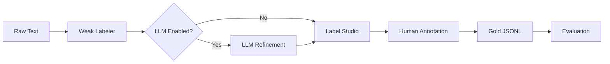

# LLM-Based Span Refinement

**Version**: 1.1  
**Last Updated**: November 27, 2025  
**Phase**: 4.5 - LLM Integration Complete

---

## Overview

SpanForge integrates Large Language Models (LLMs) to refine weak label span boundaries, validate negation, and normalize entities before human annotation. This optional step reduces annotator workload by:

- **Correcting boundaries**: Removes superfluous adjectives ("severe burning" → "burning")
- **Validating negation**: Confirms negated spans maintain semantic accuracy
- **Normalizing terms**: Maps colloquial language to canonical lexicon entries
- **Quantifying improvement**: Tracks IOU uplift and correction rates via evaluation harness

---

## Quick Start

### 1. Installation

```powershell
# Install LLM dependencies (optional)
pip install -r requirements-llm.txt
```

Includes:
- `openai>=1.0.0` (OpenAI + Azure OpenAI)
- `anthropic>=0.18.0` (Anthropic Claude)
- `tenacity>=8.0.0` (retry logic with exponential backoff)

### 2. Configure Provider

**Set Environment Variables:**

```powershell
# OpenAI
$env:OPENAI_API_KEY = "sk-..."

# Azure OpenAI
$env:AZURE_OPENAI_API_KEY = "your-key"
$env:AZURE_OPENAI_ENDPOINT = "https://your-resource.openai.azure.com/"

# Anthropic
$env:ANTHROPIC_API_KEY = "sk-ant-..."
```

### 3. Run Refinement

```powershell
python scripts/annotation/cli.py refine-llm \
  --weak data/weak_labels.jsonl \
  --output data/llm_refined.jsonl \
  --provider openai \
  --model gpt-4-turbo
```

### 4. Evaluate Results

```powershell
# Generate metrics report
python scripts/annotation/evaluate_llm_refinement.py \
  --weak data/weak_labels.jsonl \
  --refined data/llm_refined.jsonl \
  --gold data/gold_standard.jsonl \
  --output data/annotation/reports/evaluation.json \
  --markdown \
  --stratify label confidence span_length

# Visualize improvements (optional)
pip install -r requirements-viz.txt
python scripts/annotation/plot_llm_metrics.py \
  --report data/annotation/reports/evaluation.json \
  --output-dir data/annotation/plots/
```

---

## Supported Providers

### 1. Stub Mode (Default)
- **Use Case**: Testing without API costs
- **Behavior**: Returns empty suggestions for dry-run testing
- **Configuration**: `llm_provider="stub"` (no API key needed)

### 2. OpenAI
- **Models**: `gpt-4`, `gpt-4-turbo`, `gpt-3.5-turbo`
- **Cost**: ~$0.03/1K input tokens (gpt-4), ~$0.0005/1K (gpt-3.5-turbo)
- **Environment**: `OPENAI_API_KEY`

### 3. Azure OpenAI
- **Models**: Your deployed models (e.g., custom gpt-4 deployment)
- **Cost**: Same as OpenAI pricing
- **Environment**: `AZURE_OPENAI_API_KEY`, `AZURE_OPENAI_ENDPOINT`

### 4. Anthropic Claude
- **Models**: `claude-3-5-sonnet-20241022`, `claude-3-haiku`, `claude-3-opus`
- **Cost**: ~$0.003/1K input tokens (sonnet), ~$0.00025/1K (haiku)
- **Environment**: `ANTHROPIC_API_KEY`

---

## Configuration

### Code Configuration

```python
from src.config import AppConfig
from src.llm_agent import LLMAgent

config = AppConfig(
    llm_enabled=True,
    llm_provider="openai",  # "stub", "openai", "azure", "anthropic"
    llm_model="gpt-4-turbo",
    llm_temperature=0.1,  # Low temperature for consistency
    llm_max_retries=3,  # Exponential backoff retry
    llm_min_confidence=0.65,  # Confidence threshold for keeping suggestions
    llm_cache_path="data/annotation/exports/llm_cache.jsonl",
    llm_prompt_version="v1",
)

agent = LLMAgent(config)
```

### CLI Configuration

```powershell
python scripts/annotation/cli.py refine-llm \
  --weak weak.jsonl \
  --output refined.jsonl \
  --provider openai \
  --model gpt-4-turbo \
  --temperature 0.1 \
  --min-confidence 0.65 \
  --dry-run  # Preview without API calls
```

---

## Workflow Integration



**Recommended Path:**
1. Generate weak labels with high recall (accept some noise)
2. Apply LLM refinement to mid-confidence spans (0.55–0.75)
3. Import to Label Studio for human review
4. Evaluate: weak → LLM → gold to measure IOU uplift

---

## Features

### Response Caching
- All API responses cached to `data/annotation/exports/llm_cache.jsonl`
- Keyed by prompt hash (SHA256) for deterministic lookup
- Prevents duplicate API calls and reduces costs

### Retry Logic (via `tenacity`)
- Exponential backoff: 2s, 4s, 8s delays
- Up to 3 attempts for transient failures (rate limits, timeouts)
- Graceful degradation if retry package not installed

### Error Handling
- **Missing API key**: Clear error with setup instructions
- **SDK not installed**: Prompts to run `pip install -r requirements-llm.txt`
- **API errors**: Returns empty spans with error note (no crash)
- **Unsupported provider**: Validation error with supported provider list

### Provenance Tracking
Each LLM-refined span includes:
- `source="llm_refine"` (vs `"weak"`)
- `llm_confidence` (0-1 score)
- `canonical` (normalized entity form)
- `llm_meta`: `{provider, model, prompt_version, timestamp}`

---

## Evaluation Metrics

### Core Metrics (from `src/evaluation/metrics.py`)

1. **IOU (Intersection over Union)**: Span boundary overlap (0-1)
2. **Boundary Precision**: Exact match rate + mean/median IOU
3. **IOU Delta**: Weak → LLM improvement per span
4. **Correction Rate**: Categorizes spans as improved/worsened/unchanged
5. **Calibration Curve**: Confidence reliability (binned IOU vs confidence)
6. **Precision/Recall/F1**: Standard NER metrics vs gold standard

### Stratification

Analyze performance across:
- **Label**: SYMPTOM vs PRODUCT
- **Confidence**: Bucketed by score (e.g., 0.6-0.7, 0.7-0.8)
- **Span Length**: Short (<10 chars) vs medium vs long (>30 chars)

### Example Results (Test Fixtures)

```
Overall Metrics:
- IOU Improvement: +13.4% (0.882 → 1.000)
- Exact Match Rate: 66.7% → 100.0%
- Correction Rate: 100% improved (2/2 modified spans)
- F1 Score: 1.000 (perfect precision/recall)

Corrections:
- "severe burning sensation" → "burning sensation" (+18.2% IOU)
- "mild redness" → "redness" (+8.3% IOU)
```

### Visualization Outputs

Run `plot_llm_metrics.py` to generate:
1. **IOU Uplift** (`iou_uplift.png`): Weak vs LLM distributions
2. **Calibration Curve** (`calibration_curve.png`): Confidence reliability
3. **Correction Rate** (`correction_rate.png`): Pie + bar chart breakdown
4. **P/R/F1 Comparison** (`prf_comparison.png`): Side-by-side weak vs LLM
5. **Stratified Label** (`stratified_label.png`): F1 by entity type
6. **Stratified Confidence** (`stratified_confidence.png`): IOU delta across buckets

All plots are publication-quality (300 DPI default), colorblind-safe palette.

---

## Cost Management

### Tips for Reducing Costs

1. **Use Caching**: Automatic caching prevents duplicate calls
2. **Start with Stub Mode**: Develop/test without API costs
3. **Smaller Models**: Use `gpt-3.5-turbo` or `claude-haiku` for initial runs
4. **Batch Processing**: Amortize setup overhead across multiple texts
5. **Confidence Filtering**: Only refine mid-confidence spans (0.55–0.75)
6. **Sample First**: Evaluate on 100 examples before full dataset

### Approximate Costs (as of November 2025)

| Provider | Model | Input Cost | Output Cost | Est. Cost/1K Complaints |
|----------|-------|------------|-------------|-------------------------|
| OpenAI | gpt-4-turbo | $10 / 1M | $30 / 1M | ~$5-10 |
| OpenAI | gpt-3.5-turbo | $0.50 / 1M | $1.50 / 1M | ~$0.25-0.50 |
| Anthropic | claude-3-5-sonnet | $3 / 1M | $15 / 1M | ~$2-5 |
| Anthropic | claude-3-haiku | $0.25 / 1M | $1.25 / 1M | ~$0.20-0.40 |

*Assumes ~200 tokens per complaint (100 input, 100 output). Check provider websites for current pricing.*

---

## Prompt Engineering

### Current Prompts (`prompts/`)

1. **boundary_refine.txt**: Tightens span boundaries
   - Removes adjectives (severe, mild, slight)
   - Removes determiners (the, a, an)
   - Preserves core symptom/product text

2. **negation_check.txt**: Validates negation flags
   - Confirms "no burning" is correctly negated
   - Detects false positives ("burn-free" vs "burning")

3. **synonym_expand.txt**: Normalizes to canonical forms
   - Maps "itching" → "Pruritus"
   - Maps "redness" → "Erythema"
   - Provides synonym lists for fuzzy matching

### Template Placeholders

- `{{text}}`: Full input text
- `{{candidates}}`: JSON list of weak spans
- `{{knowledge}}`: Optional lexicon context
- `{{confidence_threshold}}`: Minimum score to keep suggestions

### Versioning

Prompts are versioned (`v1`, `v2`) and stored in `llm_meta.prompt_version` for reproducibility. When iterating, create new versions and compare via evaluation harness.

---

## Data Formats

### Input (Weak Labels)

```json
{
  "id": "complaint_001",
  "text": "Patient reports severe burning sensation.",
  "spans": [
    {
      "start": 15,
      "end": 43,
      "text": "severe burning sensation",
      "label": "SYMPTOM",
      "confidence": 0.85,
      "source": "weak"
    }
  ]
}
```

### Output (LLM Refined)

```json
{
  "id": "complaint_001",
  "text": "Patient reports severe burning sensation.",
  "spans": [
    {
      "start": 22,
      "end": 40,
      "text": "burning sensation",
      "label": "SYMPTOM",
      "confidence": 0.92,
      "source": "llm_refine",
      "canonical": "Burning Sensation",
      "llm_meta": {
        "provider": "openai",
        "model": "gpt-4-turbo",
        "prompt_version": "v1",
        "timestamp": "2025-11-27T10:15:30Z"
      }
    }
  ]
}
```

---

## Testing

### Run Test Suite

```powershell
# All LLM tests
pytest tests/test_llm_agent.py -v

# With coverage
pytest tests/test_llm_agent.py --cov=src.llm_agent --cov-report=term-missing

# Evaluation harness tests
pytest tests/test_evaluate_llm.py -v
```

**Coverage**: 15/15 LLM agent tests passing, 27/27 evaluation tests passing (100%).

### Integration Tests

```powershell
# End-to-end workflow
pytest tests/integration/test_llm_workflow.py -v
```

---

## Troubleshooting

### "openai package not installed"
```powershell
pip install -r requirements-llm.txt
```

### "OPENAI_API_KEY environment variable not set"
```powershell
$env:OPENAI_API_KEY = "sk-your-key-here"
```

### "API error: 429 Too Many Requests"
- Rate limit exceeded
- Retry logic handles automatically (exponential backoff)
- Reduce request frequency or upgrade API tier

### Cache file corruption
```powershell
# Clear cache and regenerate
Remove-Item data\annotation\exports\llm_cache.jsonl
```

### Import errors with tenacity
```powershell
pip install tenacity>=8.0.0
```

---

## Limitations & Future Work

### Current Limitations
- LLM may over-correct colloquial phrasing (monitor via `correction_rate` worsened %)
- Calibration curve requires ≥50 spans per bucket for statistical reliability
- Visualization requires optional dependencies (`matplotlib`, `seaborn`)
- No batch API support yet (processes sequentially)

### Roadmap
- [ ] Batch API integration for cost/speed optimization
- [ ] Active learning: prioritize high-disagreement spans for annotation
- [ ] Multi-turn refinement: iterative boundary correction
- [ ] Ensemble approaches: combine multiple model outputs
- [ ] Custom fine-tuned models for domain-specific terminology

---

## References

### Provider Documentation
- [OpenAI API](https://platform.openai.com/docs)
- [Azure OpenAI Service](https://learn.microsoft.com/en-us/azure/ai-services/openai/)
- [Anthropic Claude API](https://docs.anthropic.com/claude/reference/getting-started-with-the-api)

### Related Guides
- [Production Workflow](production_workflow.md) - End-to-end annotation pipeline
- [Annotation Guide](annotation_guide.md) - Label Studio setup and best practices
- [Evaluation Workflow](production_workflow.md) - Metrics and reporting

### Research Papers
- Ratner et al. (2017): "Snorkel: Rapid Training Data Creation with Weak Supervision"
- Zhou & Li (2021): "A Survey on Neural Weak Supervision"
- Wei et al. (2022): "Chain-of-Thought Prompting Elicits Reasoning in Large Language Models"

---

**Next Steps:**
1. Evaluate LLM refinement on sample batch (100 complaints)
2. Measure IOU uplift and correction rate
3. Tune confidence threshold based on precision/recall
4. Scale to full dataset once satisfied with metrics
5. Use LLM suggestions to guide annotation priorities
