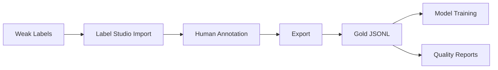

# Annotation Guide

Comprehensive guide to human annotation workflow using Label Studio.

## Overview

SpanForge uses **Label Studio** for manual annotation and weak label refinement. Annotation workflow:

1. **Export weak labels** from pipeline
2. **Import to Label Studio** as pre-annotations
3. **Human annotation** - correct, add, remove spans
4. **Export gold labels** - validated annotations
5. **Convert to training format** - JSONL with provenance
6. **Quality assurance** - inter-annotator agreement, coverage



## Setup

### Installation

```bash
# Install Label Studio
pip install label-studio

# Disable telemetry (privacy)
setx LABEL_STUDIO_DISABLE_TELEMETRY 1

# Or for current session only:
$env:LABEL_STUDIO_DISABLE_TELEMETRY = "1"
```

### Launch

```bash
# Start server (local only)
label-studio start --host localhost --port 8080

# Open browser
# Navigate to: http://localhost:8080
```

### Project Configuration

Create project with this **Label Config** (`data/annotation/config/label_config.xml`):

```xml
<View>
  <Text name="text" value="$text"/>
  <Labels name="label" toName="text">
    <Label value="SYMPTOM" background="#FF6B6B"/>
    <Label value="PRODUCT" background="#4ECDC4"/>
  </Labels>
</View>
```

**Label Descriptions:**
- **SYMPTOM** (red): Adverse events, symptoms, reactions (e.g., "itching", "severe redness")
- **PRODUCT** (teal): Product mentions, brand names, drug names (e.g., "Lotion X", "ibuprofen")

## Annotation Workflow

### 1. Export Weak Labels

```python
from src.pipeline import simple_inference
import json

# Load texts
texts = load_texts("complaints.csv")

# Generate weak labels
results = simple_inference(texts)

# Export to JSONL (Label Studio format)
output_path = "data/annotation/exports/weak_labels.jsonl"
with open(output_path, "w") as f:
    for i, result in enumerate(results):
        task = {
            "id": i,
            "data": {"text": result["text"]},
            "predictions": [{
                "result": [
                    {
                        "value": {
                            "start": entity["start"],
                            "end": entity["end"],
                            "text": entity["text"],
                            "labels": [entity["label"]]
                        },
                        "from_name": "label",
                        "to_name": "text",
                        "type": "labels"
                    }
                    for entity in result["entities"]
                ]
            }]
        }
        f.write(json.dumps(task) + "\n")

print(f"Exported {len(results)} tasks to {output_path}")
```

### 2. Import to Label Studio

1. **Create Project**: Click "Create Project"
2. **Project Name**: "SpanForge Annotation"
3. **Labeling Setup**: Paste label config XML (see above)
4. **Data Import**: 
   - Click "Import"
   - Select `weak_labels.jsonl`
   - Check "Treat as pre-annotations"
5. **Save**

### 3. Annotate Tasks

#### Task Interface

```
┌─────────────────────────────────────────────────────────────┐
│ Task 1 of 100                                     [Skip] [Submit] │
├─────────────────────────────────────────────────────────────┤
│                                                                 │
│  Patient experienced severe itching after using Lotion X       │
│                      ^^^^^^^^^^^^^^^^              ^^^^^^^^^    │
│                      SYMPTOM (weak)                PRODUCT (weak)│
│                                                                 │
├─────────────────────────────────────────────────────────────┤
│ Labels:                                                        │
│  ☐ SYMPTOM   ☐ PRODUCT                                        │
└─────────────────────────────────────────────────────────────┘
```

#### Annotation Actions

**Select span:**
1. Click and drag to highlight text
2. Choose label (SYMPTOM or PRODUCT)
3. Span appears with colored background

**Edit span:**
1. Click existing span
2. Adjust boundaries by dragging edges
3. Or delete and recreate

**Remove span:**
1. Click span to select
2. Press `Backspace` or click trash icon

**Keyboard shortcuts:**
- `S` - Select SYMPTOM label
- `P` - Select PRODUCT label
- `Backspace` - Delete selected span
- `Ctrl+Enter` - Submit task
- `Ctrl+Space` - Skip task

### 4. Annotation Guidelines

#### Boundary Rules

**✓ CORRECT:**
```
"severe burning sensation"  # Include full phrase
"redness and swelling"      # Include conjunction
"dry skin"                  # Include modifier + noun
```

**✗ INCORRECT:**
```
"severe burning sensation."  # Exclude punctuation
"burning"                    # Missing "sensation" (truncated)
" itching "                  # Exclude leading/trailing spaces
```

#### Negation Policy

**Annotate negated symptoms** - mark the span even if negated:

```
"No history of itching"
           ^^^^^^^^ SYMPTOM (annotate, flag as negated)
```

**Rationale:** Teaches model negation scope, improves recall.

**Flag negated spans** (optional):
- Add comment: "NEGATED"
- Or use separate label "SYMPTOM_NEG" (requires config change)

#### Ambiguous Cases

**Generic anatomy (alone):**
```
"Apply to skin twice daily"
         ^^^^ DON'T annotate (generic, no symptom)

"Patient has skin redness"
             ^^^^^^^^^^^^ SYMPTOM (symptom phrase)
```

**Product vs. Ingredient:**
```
"Lotion X"          → PRODUCT (brand name)
"contains retinol"  → Don't annotate (ingredient alone)
"retinol cream"     → PRODUCT (product phrase)
```

**Synonym Preference:**
```
"pruritus" → SYMPTOM (medical term, keep canonical)
"itching"  → SYMPTOM (colloquial, keep canonical)
# Canonicalization handled downstream
```

#### Common Errors

| Error | Example | Fix |
|-------|---------|-----|
| **Partial span** | "severe" instead of "severe itching" | Extend to full phrase |
| **Trailing punct** | "redness." (includes period) | Exclude punctuation |
| **Missed negation** | Skip "itching" in "No itching" | Annotate, flag negated |
| **Anatomy alone** | Annotate "skin" in "Apply to skin" | Skip unless symptom phrase |
| **Overlapping spans** | "burning" + "burning sensation" | Choose longest, most specific |

### 5. Export Gold Labels

#### From Label Studio UI

1. **Project Dashboard** → **Export**
2. **Format**: JSON
3. **Download** → `annotations.json`
4. **Save to**: `data/annotation/exports/raw/`

#### Convert to Training Format

```python
import json

# Load raw export
with open("data/annotation/exports/raw/annotations.json") as f:
    raw_annotations = json.load(f)

# Convert to gold JSONL
gold_path = "data/annotation/exports/gold_annotations.jsonl"
with open(gold_path, "w") as f:
    for task in raw_annotations:
        # Extract annotations
        annotations = task.get("annotations", [])
        if not annotations:
            continue  # Skip unannotated
        
        # Use first annotation (or consensus if multiple)
        result = annotations[0]["result"]
        
        # Convert to entity format
        entities = []
        for span in result:
            value = span["value"]
            entities.append({
                "text": value["text"],
                "start": value["start"],
                "end": value["end"],
                "label": value["labels"][0],
                "annotator": annotations[0].get("completed_by", "unknown"),
                "timestamp": annotations[0].get("created_at", ""),
            })
        
        # Write gold entry
        gold_entry = {
            "id": task["id"],
            "text": task["data"]["text"],
            "entities": entities,
            "source": "label_studio",
            "batch": "batch_001",
        }
        f.write(json.dumps(gold_entry) + "\n")

print(f"Converted {len(raw_annotations)} tasks to {gold_path}")
```

### 6. Quality Assurance

#### Coverage Report

```python
import pandas as pd

# Load gold annotations
gold = pd.read_json("data/annotation/exports/gold_annotations.jsonl", lines=True)

# Compute coverage
total_tasks = len(gold)
with_symptoms = gold["entities"].apply(lambda e: any(ent["label"] == "SYMPTOM" for ent in e)).sum()
with_products = gold["entities"].apply(lambda e: any(ent["label"] == "PRODUCT" for ent in e)).sum()
empty = gold["entities"].apply(lambda e: len(e) == 0).sum()

print(f"Total tasks: {total_tasks}")
print(f"Tasks with SYMPTOM: {with_symptoms} ({with_symptoms/total_tasks*100:.1f}%)")
print(f"Tasks with PRODUCT: {with_products} ({with_products/total_tasks*100:.1f}%)")
print(f"Tasks with no entities: {empty} ({empty/total_tasks*100:.1f}%)")
```

#### Inter-Annotator Agreement

For overlapping annotations (multiple annotators per task):

```python
from itertools import combinations

def compute_iou(span1, span2):
    """Compute IOU between two spans."""
    start = max(span1["start"], span2["start"])
    end = min(span1["end"], span2["end"])
    intersection = max(0, end - start)
    union = (span1["end"] - span1["start"]) + (span2["end"] - span2["start"]) - intersection
    return intersection / union if union > 0 else 0.0

def compute_agreement(annotations1, annotations2):
    """Compute agreement between two annotators."""
    total_matches = 0
    total_entities = len(annotations1) + len(annotations2)
    
    for ann1 in annotations1:
        for ann2 in annotations2:
            if compute_iou(ann1, ann2) >= 0.5 and ann1["label"] == ann2["label"]:
                total_matches += 1
                break
    
    return 2 * total_matches / total_entities if total_entities > 0 else 0.0

# Load multi-annotated tasks
tasks_multi = [task for task in raw_annotations if len(task.get("annotations", [])) >= 2]

# Compute pairwise agreement
agreements = []
for task in tasks_multi:
    anns = task["annotations"]
    for ann1, ann2 in combinations(anns, 2):
        entities1 = [s["value"] for s in ann1["result"]]
        entities2 = [s["value"] for s in ann2["result"]]
        agreement = compute_agreement(entities1, entities2)
        agreements.append(agreement)

avg_agreement = sum(agreements) / len(agreements) if agreements else 0.0
print(f"Average inter-annotator agreement (IOU ≥ 0.5): {avg_agreement:.2%}")
```

#### Integrity Tests

```python
def validate_gold_annotations(gold_path):
    """Validate gold annotation integrity."""
    errors = []
    
    with open(gold_path) as f:
        for i, line in enumerate(f, start=1):
            doc = json.loads(line)
            
            # Check required fields
            if "text" not in doc or "entities" not in doc:
                errors.append(f"Line {i}: Missing required fields")
                continue
            
            text = doc["text"]
            
            # Check entity integrity
            for j, entity in enumerate(doc["entities"]):
                # Check bounds
                if entity["start"] < 0 or entity["end"] > len(text):
                    errors.append(f"Line {i}, entity {j}: Out of bounds")
                
                # Check text slice
                expected_text = text[entity["start"]:entity["end"]]
                if entity["text"] != expected_text:
                    errors.append(f"Line {i}, entity {j}: Text mismatch")
                
                # Check label
                if entity["label"] not in ["SYMPTOM", "PRODUCT"]:
                    errors.append(f"Line {i}, entity {j}: Invalid label")
    
    if errors:
        print(f"Found {len(errors)} errors:")
        for error in errors[:10]:  # Show first 10
            print(f"  - {error}")
    else:
        print("✓ All annotations valid")

validate_gold_annotations("data/annotation/exports/gold_annotations.jsonl")
```

## Advanced Workflows

### Consensus Annotation

For high-quality gold labels, use **multiple annotators + consensus**:

```python
def consensus_annotation(task_annotations):
    """
    Build consensus from multiple annotations.
    
    Args:
        task_annotations: List of annotation dicts
    
    Returns:
        Consensus entities (majority vote)
    """
    from collections import defaultdict
    
    # Group overlapping spans
    span_groups = defaultdict(list)
    for ann in task_annotations:
        for entity in ann["result"]:
            value = entity["value"]
            key = (value["start"], value["end"], value["labels"][0])
            span_groups[key].append(value)
    
    # Majority vote (≥50% agreement)
    consensus = []
    min_agree = len(task_annotations) // 2 + 1
    for key, spans in span_groups.items():
        if len(spans) >= min_agree:
            consensus.append({
                "start": key[0],
                "end": key[1],
                "label": key[2],
                "text": spans[0]["text"],
                "votes": len(spans)
            })
    
    return consensus

# Apply to multi-annotated tasks
for task in tasks_multi:
    consensus = consensus_annotation(task["annotations"])
    print(f"Task {task['id']}: {len(consensus)} consensus spans")
```

### Active Learning

Prioritize uncertain examples for annotation:

```python
from src.pipeline import simple_inference

# Generate weak labels with confidence
results = simple_inference(texts)

# Find low-confidence cases
uncertain = [
    result for result in results
    if any(0.65 <= e["confidence"] < 0.80 for e in result["entities"])
]

# Export for annotation
export_to_label_studio(uncertain, "data/annotation/exports/uncertain_batch.jsonl")
```

### Annotation Drift Detection

Monitor annotation consistency over time:

```python
import pandas as pd

# Load annotations with timestamps
gold = pd.read_json("data/annotation/exports/gold_annotations.jsonl", lines=True)
gold["timestamp"] = pd.to_datetime(gold["entities"].apply(lambda e: e[0]["timestamp"] if e else None))

# Group by week
gold["week"] = gold["timestamp"].dt.isocalendar().week

# Compute weekly stats
weekly = gold.groupby("week").agg({
    "entities": lambda x: sum(len(e) for e in x),  # Total entities
}).reset_index()

weekly["symptom_rate"] = gold.groupby("week")["entities"].apply(
    lambda x: sum(sum(1 for e in entities if e["label"] == "SYMPTOM") for entities in x) / max(1, sum(len(e) for e in x))
).values

print(weekly)

# Flag drift: sudden >20% change in symptom_rate
for i in range(1, len(weekly)):
    change = abs(weekly.loc[i, "symptom_rate"] - weekly.loc[i-1, "symptom_rate"])
    if change > 0.20:
        print(f"⚠ Drift detected in week {weekly.loc[i, 'week']}: {change:.1%} change")
```

## Best Practices

1. **Calibration round** - annotate 50-100 samples, discuss disagreements, update guidelines
2. **Regular breaks** - avoid fatigue (max 2 hours continuous annotation)
3. **Randomize order** - prevent ordering bias
4. **Double annotation** - 10-20% overlap for agreement monitoring
5. **Version guidelines** - update docs as edge cases emerge
6. **Track provenance** - record annotator, timestamp, batch ID
7. **Audit regularly** - check for drift, errors, inconsistencies

## Troubleshooting

### Issue: Label Studio connection refused

**Solutions:**
```bash
# Check if server running
netstat -an | findstr "8080"

# Restart server
label-studio start --host localhost --port 8080

# Check firewall
# Ensure localhost:8080 not blocked
```

### Issue: Import fails

**Solutions:**
- Check JSONL format (one valid JSON per line)
- Validate JSON: `python -m json.tool weak_labels.jsonl`
- Ensure `data.text` field present
- Check predictions structure matches label config

### Issue: Low inter-annotator agreement

**Solutions:**
- Review guidelines with annotators
- Conduct calibration session
- Add more examples to guidelines
- Clarify ambiguous cases (anatomy, negation)
- Consider majority vote consensus

## Next Steps

- [Weak Labeling Guide](weak-labeling.md) - Understand weak labels
- [Pipeline Guide](pipeline.md) - Generate annotations
- [Configuration](../configuration.md) - Tune weak labeling
- [Development: Testing](../development/testing.md) - Test annotation pipeline
