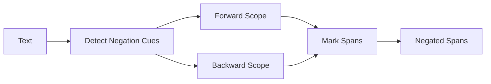

# Negation Detection Guide

Comprehensive guide to negation detection in SpanForge.

## Overview

Negation detection identifies spans that are **mentioned but explicitly denied or ruled out** by the text. Critical for:

- **Clinical accuracy** - distinguish present vs. absent symptoms
- **Adverse event classification** - separate actual AEs from negative history
- **Model training** - teach models negation scope
- **Quality control** - flag potential annotation errors

## Architecture

SpanForge implements **bidirectional negation scope detection** with configurable windows.



## Negation Tokens

### Standard Negation Cues

```python
NEGATION_TOKENS = {
    # Direct negation
    "no", "not", "none", "never", "neither", "nor",
    
    # Clinical negation
    "denies", "denied", "negative", "absent", "absence", "absence of",
    "free", "free of", "without", "fails to", "failed to",
    
    # Rule-out language
    "rule out", "ruled out", "r/o", "ruling out",
    
    # Medical descriptors
    "unremarkable", "non", "non-",
    
    # Temporal negation
    "no longer", "no more", "ceased"
}
```

### Negation Categories

| Category | Examples | Use Case |
|----------|----------|----------|
| **Direct** | no, not, never | General negation |
| **Clinical** | denies, absent, negative | Medical reports |
| **Rule-out** | r/o, rule out | Differential diagnosis |
| **Descriptor** | unremarkable, non- | Test results |
| **Temporal** | no longer, ceased | Status changes |

## Detection Algorithm

### Bidirectional Scope

```python
def is_negated(text: str, span_start: int, span_end: int, window: int = 5) -> bool:
    """
    Detect if span is negated (bidirectional).
    
    Args:
        text: Full text
        span_start: Span start character offset
        span_end: Span end character offset
        window: Scope in tokens (default: 5)
    
    Returns:
        True if negated
    """
    tokens = text.split()
    span_text = text[span_start:span_end]
    span_tokens = span_text.split()
    
    # Locate span in token stream
    span_token_start = len(text[:span_start].split())
    span_token_end = span_token_start + len(span_tokens)
    
    # Forward: negation cue BEFORE span
    forward_start = max(0, span_token_start - window)
    for i in range(forward_start, span_token_start):
        if tokens[i].lower() in NEGATION_TOKENS:
            return True
    
    # Backward: negation cue AFTER span
    backward_end = min(len(tokens), span_token_end + window)
    for i in range(span_token_end, backward_end):
        if tokens[i].lower() in NEGATION_TOKENS:
            return True
    
    return False
```

### Window Mechanics

**Forward Negation:**
```
Token indices: [0,   1,       2,  3,      4,       5]
Text:          "No  history  of  severe  itching  today"
               ^^^           ^^  ^^^^^^^^^^^^^^
               cue           |   span [3:5]
               |             |
               |<--window--->|
               [0:3]
```
- Span tokens: [3, 5) = "severe itching"
- Forward window: [0, 3) = "No history of"
- Negation cue "No" at index 0 ∈ [0, 3) → **NEGATED**

**Backward Negation:**
```
Token indices: [0,      1,   2,      3,  4]
Text:          "Itching  was  denied  by  patient"
               ^^^^^^^^      ^^^^^^
               span [0:1]    cue
                        |<-window->|
                        [1:4]
```
- Span tokens: [0, 1) = "Itching"
- Backward window: [1, 6) = "was denied by patient"
- Negation cue "denied" at index 2 ∈ [1, 6) → **NEGATED**

## Examples

### Forward Negation

```python
# Simple forward negation
text = "No itching reported"
span = {"text": "itching", "start": 3, "end": 10}
is_negated(text, span["start"], span["end"], window=5)
# Result: True (cue "No" at token 0, span at token 1, distance=1 ≤ window)

# Multi-word forward negation
text = "Patient denies severe burning sensation"
span = {"text": "severe burning sensation", "start": 15, "end": 39}
is_negated(text, span["start"], span["end"], window=5)
# Result: True (cue "denies" at token 1, span at tokens 2-4, distance=1 ≤ window)

# Out-of-scope forward
text = "Patient denies fever but reports itching"
span = {"text": "itching", "start": 37, "end": 44}
is_negated(text, span["start"], span["end"], window=5)
# Result: False (cue "denies" at token 1, span at token 6, distance=5 > window)
```

### Backward Negation

```python
# Simple backward negation
text = "Itching was denied"
span = {"text": "Itching", "start": 0, "end": 7}
is_negated(text, span["start"], span["end"], window=5)
# Result: True (span at token 0, cue "denied" at token 2, distance=2 ≤ window)

# Clinical backward negation
text = "Redness and swelling were unremarkable"
span = {"text": "Redness", "start": 0, "end": 7}
is_negated(text, span["start"], span["end"], window=5)
# Result: True (span at token 0, cue "unremarkable" at token 4, distance=4 ≤ window)

# Out-of-scope backward
text = "Redness present but unrelated to drug. Denied taking medication."
span = {"text": "Redness", "start": 0, "end": 7}
is_negated(text, span["start"], span["end"], window=5)
# Result: False (span at token 0, cue "Denied" at token 9, distance=9 > window)
```

### Complex Patterns

```python
# Conjunction scope
text = "No history of itching or redness"
span_itching = {"text": "itching", "start": 14, "end": 21}
span_redness = {"text": "redness", "start": 25, "end": 32}
is_negated(text, span_itching["start"], span_itching["end"], window=5)
# Result: True (forward negation)
is_negated(text, span_redness["start"], span_redness["end"], window=5)
# Result: True (forward negation, scope extends through "or")

# Negation + affirmation
text = "No burning but does have itching"
span_burning = {"text": "burning", "start": 3, "end": 10}
span_itching = {"text": "itching", "start": 25, "end": 32}
is_negated(text, span_burning["start"], span_burning["end"], window=5)
# Result: True (forward negation)
is_negated(text, span_itching["start"], span_itching["end"], window=5)
# Result: False (affirmation "does have" breaks negation scope)

# Rule-out language
text = "Rule out severe allergic reaction"
span = {"text": "severe allergic reaction", "start": 9, "end": 33}
is_negated(text, span["start"], span["end"], window=5)
# Result: True (forward negation, multi-word cue "rule out")
```

## Window Tuning

### Precision vs. Recall Trade-off

| Window Size | Precision | Recall | False Positives | False Negatives | Use Case |
|-------------|-----------|--------|-----------------|-----------------|----------|
| 1-2 | Very High | Low | Few | Many | Conservative, short sentences |
| 3-4 | High | Medium | Some | Some | Balanced, standard grammar |
| **5** (default) | **Balanced** | **Balanced** | **Moderate** | **Moderate** | **General use** |
| 6-7 | Medium | High | Many | Few | Long sentences, complex syntax |
| 8-10 | Low | Very High | Very Many | Very Few | Exploratory, over-mark |

### Tuning Recommendations

```python
from src.config import AppConfig

# Conservative: short-range negation only
config_conservative = AppConfig(negation_window=3)

# Standard: balanced precision/recall (recommended)
config_standard = AppConfig(negation_window=5)

# Aggressive: long-range negation
config_aggressive = AppConfig(negation_window=7)

# Exploratory: catch all possible negations
config_exploratory = AppConfig(negation_window=10)
```

### Empirical Tuning

```python
import pandas as pd
from src.weak_label import match_symptoms

# Load gold annotations
gold = pd.read_csv("gold_annotations.csv")

# Evaluate different windows
for window in [3, 5, 7, 10]:
    config = AppConfig(negation_window=window)
    
    # Run weak labeling
    predictions = []
    for text in gold["text"]:
        spans = match_symptoms(text, lexicon)
        predictions.extend(spans)
    
    # Compute metrics
    metrics = evaluate_negation(gold, predictions)
    print(f"Window={window}: P={metrics['precision']:.2f}, R={metrics['recall']:.2f}, F1={metrics['f1']:.2f}")

# Expected output:
# Window=3: P=0.92, R=0.78, F1=0.84
# Window=5: P=0.88, R=0.85, F1=0.86  ← Best F1
# Window=7: P=0.82, R=0.89, F1=0.85
# Window=10: P=0.74, R=0.93, F1=0.82
```

## Edge Cases

### Affirmative Overrides

```python
# Affirmation breaks negation scope
text = "No fever but does have itching"
# "itching" is NOT negated (affirmation "does have" resets scope)

# Implementation: Track affirmative cues
AFFIRMATIVE_CUES = {"does have", "has", "reports", "complains of", "presents with"}
# TODO: Not yet implemented; planned for future release
```

### Double Negation

```python
# Double negation = affirmation
text = "Patient does not deny itching"
# "itching" is AFFIRMED (logically)
# Current system: Marks as NEGATED (structural negation only)
# TODO: Semantic negation resolution planned
```

### Negation Boundaries

```python
# Sentence boundaries reset scope
text = "No fever. Patient has itching."
# "itching" is NOT negated (new sentence resets scope)

# Implementation: Sentence splitting
sentences = text.split('. ')
for sent in sentences:
    # Process each sentence independently
    spans = match_symptoms(sent, lexicon)
```

## Integration with Pipeline

### Weak Labeling

```python
from src.weak_label import match_symptoms
from src.config import AppConfig

config = AppConfig(negation_window=5)
text = "No history of itching or redness"

# Detect symptoms
spans = match_symptoms(text, lexicon)

# Filter by negation status
positive_symptoms = [s for s in spans if not s.get("negated", False)]
negated_symptoms = [s for s in spans if s.get("negated", False)]

print(f"Positive: {positive_symptoms}")  # []
print(f"Negated: {negated_symptoms}")    # ["itching", "redness"]
```

### Pipeline Inference

```python
from src.pipeline import simple_inference

text = "Patient denies burning but reports redness"

# Run pipeline (includes negation detection)
results = simple_inference([text])

# Check negation flags
for span in results[0]["entities"]:
    print(f"{span['text']}: negated={span.get('negated', False)}")

# Output:
# burning: negated=True
# redness: negated=False
```

### Annotation Export

```python
from src.weak_label import match_symptoms
import json

# Generate weak labels with negation
texts = ["No itching reported", "Patient has redness"]
results = []

for text in texts:
    spans = match_symptoms(text, lexicon)
    results.append({
        "text": text,
        "entities": [
            {
                "text": s["text"],
                "start": s["start"],
                "end": s["end"],
                "label": s["label"],
                "negated": s.get("negated", False),
                "confidence": s["confidence"]
            }
            for s in spans
        ]
    })

# Save for Label Studio
with open("weak_labels_with_negation.jsonl", "w") as f:
    for result in results:
        f.write(json.dumps(result) + "\n")
```

## Best Practices

1. **Always export negation flags** - critical for downstream models
2. **Use default window (5)** - well-calibrated for most cases
3. **Tune on evaluation set** - measure P/R on gold negations
4. **Handle sentence boundaries** - split long texts
5. **Document custom negation tokens** - track domain-specific cues
6. **Validate with clinicians** - ensure negation patterns match domain
7. **Track negation statistics** - monitor % negated spans

## Common Issues

### Issue: Over-marking negations

**Symptoms:**
- Many false positive negations
- Affirmative spans marked as negated

**Solutions:**
```python
# Reduce window
config = AppConfig(negation_window=3)

# Audit NEGATION_TOKENS for overly broad terms
# Remove: "non" (captures "non-prescription", "non-stop")

# Add sentence splitting
sentences = text.split('. ')
```

### Issue: Under-marking negations

**Symptoms:**
- Negated spans not detected
- Complex negation patterns missed

**Solutions:**
```python
# Increase window
config = AppConfig(negation_window=7)

# Add domain-specific negation tokens
NEGATION_TOKENS.update(["absence of", "free of", "no evidence of"])

# Enable backward negation (already default)
```

### Issue: Negation crosses sentence boundaries

**Symptoms:**
- Negation scope bleeds into next sentence

**Solutions:**
```python
# Sentence splitting before negation detection
def split_sentences(text):
    """Split on sentence boundaries."""
    return text.replace('! ', '!|').replace('? ', '?|').replace('. ', '.|').split('|')

sentences = split_sentences(text)
all_spans = []
offset = 0
for sent in sentences:
    spans = match_symptoms(sent, lexicon)
    # Adjust offsets
    for span in spans:
        span["start"] += offset
        span["end"] += offset
    all_spans.extend(spans)
    offset += len(sent) + 1  # +1 for delimiter
```

## Evaluation Metrics

### Negation-Specific Metrics

```python
def evaluate_negation(gold_annotations, predicted_spans):
    """
    Evaluate negation detection performance.
    
    Args:
        gold_annotations: Gold spans with negation flags
        predicted_spans: Predicted spans with negation flags
    
    Returns:
        Dict with negation precision/recall/F1
    """
    true_pos_neg = 0   # Correctly marked as negated
    false_pos_neg = 0  # Incorrectly marked as negated
    false_neg_neg = 0  # Should be negated, but not marked
    
    for pred in predicted_spans:
        # Find matching gold span (IOU ≥ 0.5)
        gold_match = find_matching_gold(pred, gold_annotations)
        if gold_match:
            if pred.get("negated", False) and gold_match.get("negated", False):
                true_pos_neg += 1
            elif pred.get("negated", False) and not gold_match.get("negated", False):
                false_pos_neg += 1
            elif not pred.get("negated", False) and gold_match.get("negated", False):
                false_neg_neg += 1
    
    precision = true_pos_neg / (true_pos_neg + false_pos_neg)
    recall = true_pos_neg / (true_pos_neg + false_neg_neg)
    f1 = 2 * precision * recall / (precision + recall)
    
    return {"precision": precision, "recall": recall, "f1": f1}
```

## Next Steps

- [Weak Labeling Guide](weak-labeling.md) - Full weak labeling system
- [Configuration](../configuration.md) - Tune negation window
- [API Reference](../api/weak_label.md) - Function documentation
