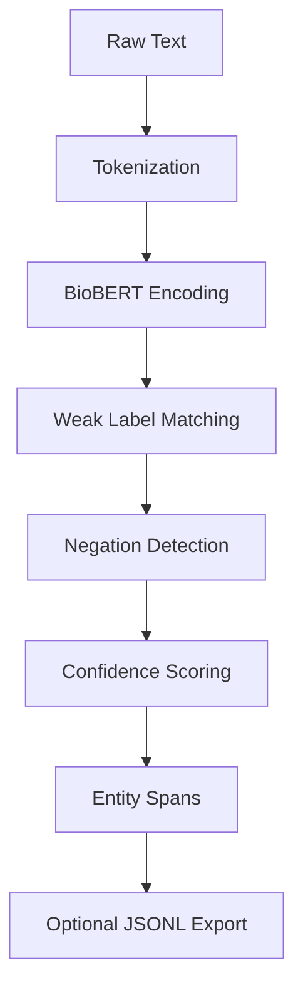

# Pipeline Guide

Comprehensive guide to SpanForge's end-to-end inference pipeline.

## Overview

The pipeline combines **BioBERT contextual embeddings** with **lexicon-based weak labeling** for biomedical NER. Processes raw text through tokenization, entity detection, and optional persistence.



## Architecture

### Components

| Component | Module | Function | Purpose |
|-----------|--------|----------|---------|
| **Tokenizer** | `src.model` | `get_tokenizer()` | Load BioBERT tokenizer |
| **Model** | `src.model` | `get_model()` | Load BioBERT encoder |
| **Encoder** | `src.model` | `encode_text()` | Generate token embeddings |
| **Weak Labeler** | `src.weak_label` | `match_symptoms()`, `match_products()` | Lexicon-based entity detection |
| **Negation** | `src.weak_label` | `is_negated()` | Bidirectional negation scope |
| **Pipeline** | `src.pipeline` | `simple_inference()` | Orchestrate end-to-end |

### Data Flow

```python
text = "Patient reports severe itching"

# 1. Tokenization
tokens = tokenizer(text)
# {'input_ids': [101, 5317, 3756, 5729, 24501, 102], ...}

# 2. BioBERT Encoding
encodings = model(**tokens)
# {last_hidden_state: tensor([...]), ...}

# 3. Weak Labeling
symptoms = match_symptoms(text, symptom_lexicon)
products = match_products(text, product_lexicon)
# [{'text': 'severe itching', 'start': 16, 'end': 30, ...}]

# 4. Negation Detection
for span in symptoms:
    span['negated'] = is_negated(text, span['start'], span['end'])

# 5. Output
result = {
    'text': text,
    'entities': symptoms + products
}
```

## Quick Start

### Basic Inference

```python
from src.pipeline import simple_inference

# Single text
text = "Patient experienced burning sensation after using Product X"
results = simple_inference([text])

# Access entities
for entity in results[0]["entities"]:
    print(f"{entity['label']}: {entity['text']} (confidence: {entity['confidence']:.2f})")

# Output:
# SYMPTOM: burning sensation (confidence: 0.91)
# PRODUCT: Product X (confidence: 0.95)
```

### Batch Processing

```python
from src.pipeline import simple_inference

# Multiple texts
texts = [
    "Patient has severe redness",
    "No itching reported",
    "Used Lotion Y with no adverse effects"
]

# Process batch
results = simple_inference(texts)

# Iterate results
for i, result in enumerate(results):
    print(f"\nText {i+1}: {result['text']}")
    for entity in result["entities"]:
        negated = " (negated)" if entity.get("negated", False) else ""
        print(f"  - {entity['label']}: {entity['text']}{negated}")

# Output:
# Text 1: Patient has severe redness
#   - SYMPTOM: severe redness
# Text 2: No itching reported
#   - SYMPTOM: itching (negated)
# Text 3: Used Lotion Y with no adverse effects
#   - PRODUCT: Lotion Y
```

### JSONL Persistence

```python
from src.pipeline import simple_inference

texts = load_texts("complaints.csv")

# Export to JSONL
output_path = "data/output/entities.jsonl"
results = simple_inference(texts, output_jsonl=output_path)

print(f"Saved {len(results)} results to {output_path}")

# Read back
import json
with open(output_path) as f:
    for line in f:
        doc = json.loads(line)
        print(f"Text: {doc['text']}")
        print(f"Entities: {len(doc['entities'])}")
```

## Advanced Usage

### Custom Configuration

```python
from src.config import AppConfig
from src.pipeline import simple_inference

# Custom config
config = AppConfig(
    negation_window=7,
    fuzzy_scorer="jaccard",
    max_seq_len=512,
    device="cuda"
)

# Use in pipeline (config automatically loaded via get_config())
results = simple_inference(texts)
```

### Filtering Entities

```python
# High-confidence entities only
high_conf = [
    entity for entity in result["entities"]
    if entity["confidence"] >= 0.85
]

# Non-negated symptoms
positive_symptoms = [
    entity for entity in result["entities"]
    if entity["label"] == "SYMPTOM" and not entity.get("negated", False)
]

# Products with symptoms (co-occurrence)
has_both = any(e["label"] == "SYMPTOM" for e in result["entities"]) and \
           any(e["label"] == "PRODUCT" for e in result["entities"])
```

### Entity Grouping

```python
from collections import defaultdict

# Group by label
grouped = defaultdict(list)
for entity in result["entities"]:
    grouped[entity["label"]].append(entity)

print(f"Symptoms: {len(grouped['SYMPTOM'])}")
print(f"Products: {len(grouped['PRODUCT'])}")

# Group by canonical form
canonical_groups = defaultdict(list)
for entity in result["entities"]:
    canonical_groups[entity["canonical"]].append(entity)

# Find duplicates
duplicates = {k: v for k, v in canonical_groups.items() if len(v) > 1}
```

### Confidence Histograms

```python
import matplotlib.pyplot as plt

# Collect confidences
confidences = [e["confidence"] for result in results for e in result["entities"]]

# Plot distribution
plt.hist(confidences, bins=20, range=(0, 1.0), edgecolor='black')
plt.xlabel("Confidence Score")
plt.ylabel("Frequency")
plt.title("Entity Confidence Distribution")
plt.axvline(x=0.85, color='r', linestyle='--', label='Threshold')
plt.legend()
plt.show()
```

## Pipeline Components

### 1. Tokenization

```python
from src.model import get_tokenizer, encode_text

tokenizer = get_tokenizer()
text = "Patient has severe burning sensation"

# Tokenize
tokens = tokenizer(
    text,
    padding="max_length",
    truncation=True,
    max_length=256,
    return_tensors="pt"
)

print(tokens["input_ids"])
# tensor([[  101,  5317,  2038,  5729, 10566,  8006,   102,     0,     0, ...]])

# Token IDs to text
decoded = tokenizer.decode(tokens["input_ids"][0])
print(decoded)
# [CLS] Patient has severe burning sensation [SEP] [PAD] [PAD] ...
```

### 2. BioBERT Encoding

```python
from src.model import get_model, encode_text

model = get_model()
text = "Patient has severe burning sensation"

# Encode
encoding = encode_text(text)

print(encoding.keys())
# dict_keys(['input_ids', 'token_type_ids', 'attention_mask'])

print(encoding["input_ids"].shape)
# torch.Size([1, 256])

# Get embeddings (requires model forward pass)
with torch.no_grad():
    outputs = model(**encoding)
    embeddings = outputs.last_hidden_state  # [1, 256, 768]

print(f"Embedding shape: {embeddings.shape}")
# Embedding shape: torch.Size([1, 256, 768])
```

### 3. Weak Labeling

```python
from src.weak_label import match_symptoms, match_products
import pandas as pd

# Load lexicons
symptoms = pd.read_csv("data/lexicon/symptoms.csv")["symptom"].tolist()
products = pd.read_csv("data/lexicon/products.csv")["product"].tolist()

text = "Patient used Lotion X and experienced severe itching"

# Detect entities
symptom_spans = match_symptoms(text, symptoms)
product_spans = match_products(text, products)

print(f"Symptoms: {[s['text'] for s in symptom_spans]}")
print(f"Products: {[p['text'] for p in product_spans]}")

# Output:
# Symptoms: ['severe itching']
# Products: ['Lotion X']
```

### 4. Negation Detection

```python
from src.weak_label import match_symptoms
from src.config import AppConfig

config = AppConfig(negation_window=5)
text = "No history of itching or redness"

# Detect symptoms
spans = match_symptoms(text, symptoms)

# Check negation
for span in spans:
    negated = span.get("negated", False)
    print(f"{span['text']}: negated={negated}")

# Output:
# itching: negated=True
# redness: negated=True
```

### 5. Postprocessing

```python
from src.pipeline import postprocess_predictions

# Predictions (mock)
predictions = [
    {"text": "itching", "start": 10, "end": 17, "label": "SYMPTOM", "confidence": 0.92},
    {"text": "itching", "start": 10, "end": 17, "label": "SYMPTOM", "confidence": 0.88},  # duplicate
    {"text": "redness", "start": 22, "end": 29, "label": "SYMPTOM", "confidence": 0.75},
]

# Deduplicate & filter
processed = postprocess_predictions(predictions, min_confidence=0.80)

print(f"Original: {len(predictions)} spans")
print(f"Processed: {len(processed)} spans")

# Output:
# Original: 3 spans
# Processed: 1 spans (deduplicated, filtered by confidence)
```

## Performance Optimization

### CPU Optimization

```python
from src.config import AppConfig

# CPU-friendly config
config = AppConfig(
    device="cpu",
    max_seq_len=128,  # Shorter sequences
)

# Process in smaller batches
batch_size = 8
for i in range(0, len(texts), batch_size):
    batch = texts[i:i+batch_size]
    results = simple_inference(batch)
```

### GPU Optimization

```python
from src.config import AppConfig
import torch

# GPU config
config = AppConfig(
    device="cuda",
    max_seq_len=512,
)

# Enable cuDNN autotuner
torch.backends.cudnn.benchmark = True

# Larger batches
batch_size = 64
results = simple_inference(texts[:batch_size])
```

### Memory Management

```python
import torch

# Process very large datasets
results = []
for i, text in enumerate(texts):
    result = simple_inference([text])
    results.append(result[0])
    
    # Clear cache every 100 texts
    if i % 100 == 0:
        torch.cuda.empty_cache()
        print(f"Processed {i}/{len(texts)}")
```

## Error Handling

### Graceful Degradation

```python
from src.pipeline import simple_inference

texts = ["Valid text", "", None, "Another valid text"]

# Handle errors
results = []
for text in texts:
    try:
        if not text:
            raise ValueError("Empty text")
        result = simple_inference([text])
        results.append(result[0])
    except Exception as e:
        print(f"Error processing text: {e}")
        results.append({"text": text, "entities": [], "error": str(e)})
```

### Input Validation

```python
def validate_input(text):
    """Validate input text."""
    if not isinstance(text, str):
        raise TypeError(f"Expected str, got {type(text)}")
    if not text.strip():
        raise ValueError("Empty text")
    if len(text) > 10000:
        raise ValueError("Text too long (>10,000 chars)")
    return text.strip()

# Safe inference
validated_texts = [validate_input(t) for t in texts]
results = simple_inference(validated_texts)
```

## Integration Patterns

### Stream Processing

```python
from src.pipeline import simple_inference

def process_stream(input_stream, output_stream, batch_size=32):
    """Process streaming data."""
    batch = []
    for text in input_stream:
        batch.append(text)
        if len(batch) >= batch_size:
            results = simple_inference(batch)
            for result in results:
                output_stream.write(json.dumps(result) + "\n")
            batch = []
    
    # Process remaining
    if batch:
        results = simple_inference(batch)
        for result in results:
            output_stream.write(json.dumps(result) + "\n")

# Usage
with open("input.txt") as infile, open("output.jsonl", "w") as outfile:
    process_stream(infile, outfile)
```

### Database Integration

```python
import sqlite3
from src.pipeline import simple_inference

# Read from database
conn = sqlite3.connect("complaints.db")
cursor = conn.execute("SELECT id, text FROM complaints WHERE processed = 0 LIMIT 1000")

# Process
results = []
for row_id, text in cursor:
    result = simple_inference([text])[0]
    results.append((row_id, json.dumps(result)))

# Write back
conn.executemany(
    "UPDATE complaints SET entities = ?, processed = 1 WHERE id = ?",
    [(entities, row_id) for row_id, entities in results]
)
conn.commit()
```

### REST API

```python
from flask import Flask, request, jsonify
from src.pipeline import simple_inference

app = Flask(__name__)

@app.route("/extract", methods=["POST"])
def extract_entities():
    """Entity extraction endpoint."""
    data = request.get_json()
    text = data.get("text", "")
    
    if not text:
        return jsonify({"error": "Missing text"}), 400
    
    # Extract entities
    results = simple_inference([text])
    
    return jsonify(results[0])

# Run server
if __name__ == "__main__":
    app.run(host="0.0.0.0", port=5000)

# Test:
# curl -X POST http://localhost:5000/extract \
#   -H "Content-Type: application/json" \
#   -d '{"text": "Patient has severe itching"}'
```

## Testing

### Unit Tests

```python
import pytest
from src.pipeline import simple_inference

def test_pipeline_basic():
    """Test basic pipeline inference."""
    text = "Patient has severe itching"
    results = simple_inference([text])
    
    assert len(results) == 1
    assert results[0]["text"] == text
    assert len(results[0]["entities"]) > 0

def test_pipeline_empty():
    """Test empty input."""
    results = simple_inference([])
    assert results == []

def test_pipeline_negation():
    """Test negation detection."""
    text = "No itching reported"
    results = simple_inference([text])
    
    entities = results[0]["entities"]
    assert any(e["text"] == "itching" and e.get("negated", False) for e in entities)
```

### Integration Tests

```python
import tempfile
from src.pipeline import simple_inference

def test_pipeline_jsonl_export():
    """Test JSONL export."""
    texts = ["Text 1", "Text 2"]
    
    with tempfile.NamedTemporaryFile(mode="w", suffix=".jsonl", delete=False) as f:
        output_path = f.name
    
    # Export
    results = simple_inference(texts, output_jsonl=output_path)
    
    # Read back
    with open(output_path) as f:
        lines = f.readlines()
    
    assert len(lines) == len(texts)
    
    import json
    parsed = [json.loads(line) for line in lines]
    assert all("text" in doc and "entities" in doc for doc in parsed)
```

## Best Practices

1. **Batch processing** - process multiple texts at once for efficiency
2. **Error handling** - wrap inference in try-except for production
3. **Input validation** - check text length, encoding, emptiness
4. **Memory management** - clear GPU cache periodically for large datasets
5. **Confidence filtering** - set minimum thresholds for downstream use
6. **JSONL persistence** - use for audit trails and reproducibility
7. **Monitoring** - track processing time, entity counts, confidence distribution

## Common Issues

### Issue: Slow processing

**Solutions:**
```python
# Use GPU
config = AppConfig(device="cuda")

# Reduce sequence length
config = AppConfig(max_seq_len=128)

# Process in batches
batch_size = 32
results = simple_inference(texts[:batch_size])
```

### Issue: CUDA out of memory

**Solutions:**
```python
# Force CPU
config = AppConfig(device="cpu")

# Reduce batch size
batch_size = 8

# Clear cache
import torch
torch.cuda.empty_cache()
```

### Issue: Low entity recall

**Solutions:**
```python
# Lower fuzzy threshold
spans = match_symptoms(text, lexicon, fuzzy_threshold=82.0)

# Extend negation window
config = AppConfig(negation_window=7)

# Audit lexicon coverage
missing_terms = find_missing_lexicon_terms(gold_annotations, lexicon)
```

## Next Steps

- [Weak Labeling Guide](weak-labeling.md) - Advanced techniques
- [Negation Guide](negation.md) - Negation patterns
- [Configuration](../configuration.md) - Tune parameters
- [API Reference](../api/pipeline.md) - Full API documentation
