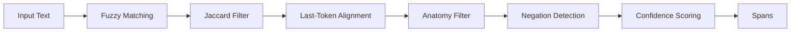

# Weak Labeling Guide

Comprehensive guide to SpanForge's weak labeling system for biomedical entity recognition.

## Overview

Weak labeling uses **lexicon-based fuzzy matching** with **rule-based filters** to automatically annotate symptoms and product mentions without manual labels. Produces high-recall, moderate-precision spans suitable for:

1. **Bootstrapping annotation** - seed Label Studio with candidate spans
2. **Active learning** - prioritize uncertain examples
3. **Evaluation baselines** - compare supervised models

## Architecture



## Core Components

### 1. Lexicon Matching

#### Fuzzy Matching (WRatio)

Uses **RapidFuzz WRatio** for typo-tolerant matching.

**Algorithm:**
```
1. Tokenize text into n-grams (1-6 tokens)
2. For each n-gram:
   a. Compute WRatio against lexicon entries
   b. If score ≥ threshold (default: 88.0):
      - Record match
```

**Example:**
```python
from src.weak_label import match_symptoms

text = "Patient experienced seveer itching"  # typo: "seveer"
lexicon = ["severe itching", "itching", "redness"]

spans = match_symptoms(text, lexicon, fuzzy_threshold=88.0)
# Matches "seveer itching" → "severe itching" (WRatio: 94.7)
```

**WRatio Characteristics:**
- Handles typos: "seveer" → "severe"
- Handles word order: "itching severe" → "severe itching"
- Handles partial matches: "severe burning itching" → "severe itching"

#### Jaccard Token-Set Filter

Filters out low-quality fuzzy matches using token overlap.

**Algorithm:**
```
1. Tokenize span and lexicon entry
2. Compute Jaccard similarity: |A ∩ B| / |A ∪ B| * 100
3. Accept if Jaccard ≥ threshold (default: 40.0)
```

**Example:**
```python
# Good match: high fuzzy + high Jaccard
span = "burning sensation"
entry = "burning"
# WRatio: 90.0, Jaccard: 50.0 → ACCEPT

# Bad match: high fuzzy + low Jaccard (coincidental similarity)
span = "patient history"
entry = "burning"
# WRatio: 89.0, Jaccard: 0.0 → REJECT
```

**Why Jaccard?**
- Prevents false positives from short common words
- Ensures semantic relevance
- Complements fuzzy matching

### 2. Rule-Based Filters

#### Last-Token Alignment

Requires multi-token fuzzy matches to end at token boundaries.

**Rationale:** Prevents partial-word matches.

```python
# ACCEPT: "severe itching" ends at token boundary
text = "Patient has severe itching today"
match = "severe itching"  # ✓ ends after "itching"

# REJECT: "severe itch" doesn't end at boundary
text = "Patient has severe itching today"
match = "severe itch"  # ✗ ends mid-word "itching"
```

**Implementation:**
```python
def is_last_token_aligned(text, start, end):
    """Check if span ends at token boundary."""
    if end >= len(text):
        return True
    next_char = text[end]
    return next_char in [' ', '.', ',', '!', '?', '\n']
```

#### Anatomy Filter

Rejects single-token anatomy mentions unless co-occurring with symptom keywords.

**Rationale:** "skin" alone is too generic; "skin redness" is a symptom.

```python
ANATOMY_TOKENS = {"skin", "eye", "face", "hand", "arm", ...}
SYMPTOM_KEYWORDS = {"burning", "itching", "redness", "pain", ...}

# REJECT: standalone anatomy
text = "Apply to skin twice daily"
match = "skin"  # ✗ no symptom co-occurrence

# ACCEPT: anatomy + symptom
text = "Patient reported skin burning"
match = "skin"  # ✓ co-occurs with "burning"
```

**List of Anatomy Tokens:**
```
skin, eye, eyes, face, hand, hands, arm, arms, leg, legs, 
foot, feet, scalp, chest, back, neck, finger, fingers, 
toe, toes, nail, nails, lip, lips, mouth, tongue, throat, 
stomach, abdomen, head
```

### 3. Negation Detection

Bidirectional negation scope detection with configurable window.

**Forward Negation** (standard):
```
Negation cue → [window tokens] → span
         "no"     [history of]    itching
```

**Backward Negation** (new):
```
   span   ← [window tokens] ← Negation cue
itching     [was denied by]       patient
```

#### Negation Tokens

```python
NEGATION_TOKENS = {
    "no", "not", "none", "never", "without", "denies", 
    "denied", "negative", "free", "absent", "rule out", 
    "ruled out", "r/o", "unremarkable", "non", "free of",
    "absence", "absence of", "fails to", "failed to"
}
```

#### Algorithm

```python
def is_negated(text, span_start, span_end, window=5):
    """
    Check if span is negated (forward or backward).
    
    Args:
        text: Full text
        span_start: Span start character offset
        span_end: Span end character offset
        window: Negation scope in tokens (default: 5)
    
    Returns:
        True if negated
    """
    tokens = text.split()
    span_tokens = text[span_start:span_end].split()
    
    # Find span token indices
    span_token_start = len(text[:span_start].split())
    span_token_end = span_token_start + len(span_tokens)
    
    # Forward: negation cue before span
    forward_start = max(0, span_token_start - window)
    for i in range(forward_start, span_token_start):
        if tokens[i].lower() in NEGATION_TOKENS:
            return True
    
    # Backward: negation cue after span
    backward_end = min(len(tokens), span_token_end + window)
    for i in range(span_token_end, backward_end):
        if tokens[i].lower() in NEGATION_TOKENS:
            return True
    
    return False
```

**Examples:**

```python
# Forward negation
text = "No history of itching or redness"
# "itching" (tokens 3-3) negated by "No" (token 0) [window=5]
is_negated(text, ..., window=5)  # True

# Backward negation
text = "Itching was denied by patient"
# "Itching" (token 0) negated by "denied" (token 2) [window=5]
is_negated(text, ..., window=5)  # True

# Out of scope
text = "Patient denies fever but reports itching"
# "itching" (token 6) NOT negated by "denies" (token 1) [window=5, gap=5]
is_negated(text, ..., window=5)  # False
```

#### Tuning Negation Window

| Window | Precision | Recall | Use Case |
|--------|-----------|--------|----------|
| 3 | High | Low | Conservative, short sentences |
| 5 | Balanced | Balanced | **Default recommendation** |
| 7 | Medium | High | Long sentences, complex grammar |
| 10 | Low | Very High | Exploratory, accept over-marking |

```python
from src.config import AppConfig

# Conservative negation
config = AppConfig(negation_window=3)

# Aggressive negation
config = AppConfig(negation_window=10)
```

### 4. Confidence Scoring

Weighted combination of fuzzy and Jaccard scores.

**Formula:**
```
confidence = 0.8 × fuzzy_score + 0.2 × jaccard_score
confidence = min(confidence, 1.0)  # clamp
```

**Rationale:**
- Fuzzy score (80% weight) - primary signal
- Jaccard score (20% weight) - quality gate
- Clamping prevents impossible >1.0 values

**Example:**
```python
span = "burning sensation"
lexicon_entry = "burning"

fuzzy_score = 90.0  # high similarity
jaccard_score = 50.0  # moderate overlap

confidence = 0.8 * 90.0 + 0.2 * 50.0
confidence = 72.0 + 10.0 = 82.0
```

## Advanced Usage

### Custom Lexicons

```python
from src.weak_label import match_symptoms

# Load custom lexicon
custom_lexicon = [
    "proprietary syndrome X",
    "brand-specific reaction",
    "custom symptom term"
]

spans = match_symptoms(
    text="Patient had brand-specific reaction",
    lexicon=custom_lexicon,
    fuzzy_threshold=88.0
)
```

### Batch Processing

```python
from src.weak_label import match_symptoms, match_products
import pandas as pd

# Load data
df = pd.read_csv("complaints.csv")

# Load lexicons
symptoms = pd.read_csv("data/lexicon/symptoms.csv")["symptom"].tolist()
products = pd.read_csv("data/lexicon/products.csv")["product"].tolist()

# Process batch
results = []
for text in df["complaint_text"]:
    symptom_spans = match_symptoms(text, symptoms)
    product_spans = match_products(text, products)
    results.append({
        "text": text,
        "symptoms": symptom_spans,
        "products": product_spans
    })
```

### Confidence Filtering

```python
# High-confidence spans only
spans = match_symptoms(text, lexicon)
high_conf = [s for s in spans if s["confidence"] >= 0.85]

# Low-confidence spans (for review)
review_queue = [s for s in spans if 0.65 <= s["confidence"] < 0.85]
```

### Negation-Aware Filtering

```python
# Exclude negated spans
positive_spans = [s for s in spans if not s.get("negated", False)]

# Negated spans only (for training negation classifier)
negated_spans = [s for s in spans if s.get("negated", False)]
```

## Performance Optimization

### CPU Optimization

```python
# Use exact matching for small lexicons
def exact_match(text, lexicon):
    """Exact substring matching (fast)."""
    spans = []
    for term in lexicon:
        start = 0
        while True:
            idx = text.lower().find(term.lower(), start)
            if idx == -1:
                break
            spans.append({
                "text": text[idx:idx+len(term)],
                "start": idx,
                "end": idx + len(term),
                "label": "SYMPTOM",
                "confidence": 1.0,
                "canonical": term
            })
            start = idx + 1
    return spans
```

### Threshold Tuning

```python
# Higher thresholds = higher precision, lower recall
strict_spans = match_symptoms(text, lexicon, fuzzy_threshold=92.0)

# Lower thresholds = higher recall, lower precision
lenient_spans = match_symptoms(text, lexicon, fuzzy_threshold=82.0)
```

## Evaluation Metrics

### Precision/Recall

```python
def evaluate_weak_labels(gold_annotations, predicted_spans):
    """
    Evaluate weak labeling performance.
    
    Args:
        gold_annotations: List of gold spans
        predicted_spans: List of predicted spans
    
    Returns:
        Dict with precision, recall, F1
    """
    true_positives = 0
    false_positives = 0
    false_negatives = 0
    
    for pred in predicted_spans:
        matched = False
        for gold in gold_annotations:
            # IOU overlap ≥ 0.5
            overlap = compute_iou(pred, gold)
            if overlap >= 0.5 and pred["label"] == gold["label"]:
                true_positives += 1
                matched = True
                break
        if not matched:
            false_positives += 1
    
    false_negatives = len(gold_annotations) - true_positives
    
    precision = true_positives / (true_positives + false_positives)
    recall = true_positives / (true_positives + false_negatives)
    f1 = 2 * precision * recall / (precision + recall)
    
    return {"precision": precision, "recall": recall, "f1": f1}
```

### Confidence Calibration

```python
import matplotlib.pyplot as plt

# Plot confidence distribution
confidences = [s["confidence"] for s in spans]
plt.hist(confidences, bins=20, range=(0, 100))
plt.xlabel("Confidence Score")
plt.ylabel("Frequency")
plt.title("Weak Label Confidence Distribution")
plt.show()
```

## Best Practices

1. **Start with high thresholds** (fuzzy=90, Jaccard=45) - prioritize precision
2. **Tune on evaluation set** - measure P/R/F1 on gold annotations
3. **Use bidirectional negation** - captures more negation patterns
4. **Filter anatomy singletons** - reduces false positives
5. **Require last-token alignment** - prevents partial-word matches
6. **Cache lexicon lookups** - speeds up batch processing
7. **Version lexicons** - track changes for reproducibility

## Common Pitfalls

### Issue: High false positive rate

**Causes:**
- Fuzzy threshold too low
- Missing anatomy filter
- Lexicon contains generic terms

**Solutions:**
```python
# Increase thresholds
spans = match_symptoms(text, lexicon, fuzzy_threshold=92.0)

# Add anatomy filter (already default)

# Audit lexicon for generic terms
generic_terms = ["skin", "patient", "product"]  # remove these
```

### Issue: Missing multi-word symptoms

**Causes:**
- Lexicon only has single-word entries
- Last-token alignment too strict

**Solutions:**
```python
# Add multi-word entries to lexicon
lexicon = [
    "burning sensation",  # not just "burning"
    "severe itching",     # not just "itching"
    "dry skin"            # not just "dry"
]
```

### Issue: Over-aggressive negation

**Causes:**
- Negation window too large
- Negation token list too broad

**Solutions:**
```python
# Reduce window
config = AppConfig(negation_window=3)

# Audit NEGATION_TOKENS for overly broad terms
```

## Next Steps

- [Configuration](configuration.md) - Tune thresholds
- [Negation Guide](user-guide/negation.md) - Advanced negation patterns
- [API Reference](api/weak_label.md) - Full function documentation
